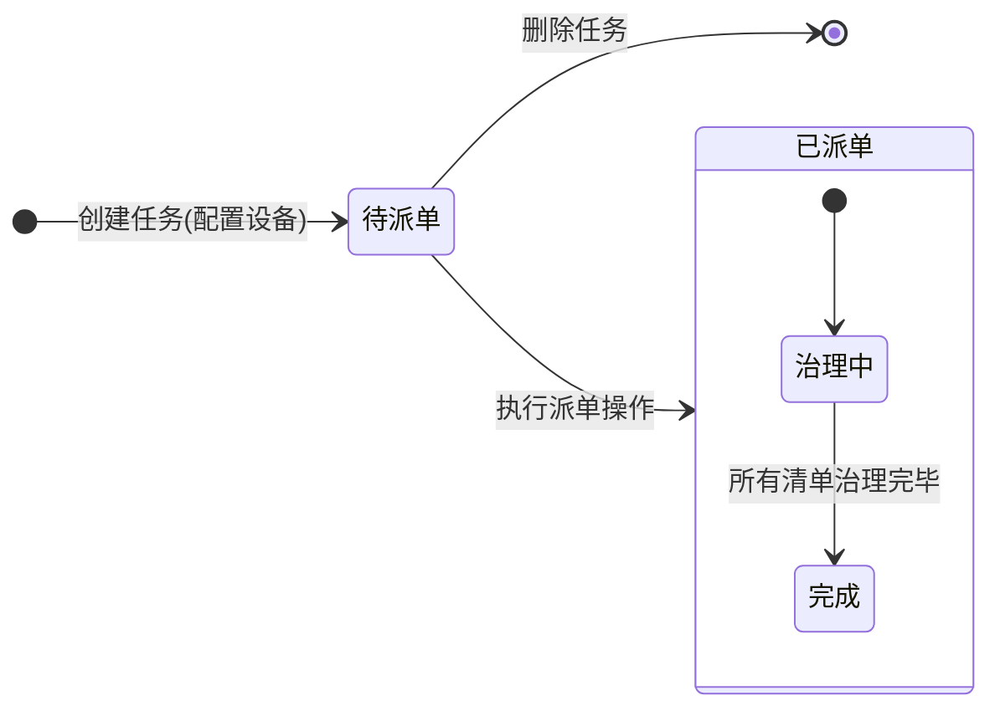

# 3. 设备治理

## 3.1 治理任务

### 3.1.0 任务状态流转图

管理员将需要治理的设备添加到治理任务，选择需要治理的类型，然后派单给治理人员。

### 3.1.1 任务列表

#### 1. 搜索项

*   **任务名称**：模糊查询。
*   **治理人员**：模糊查询。
*   **任务状态**：枚举值，待派单、已派单。

#### 2. 列表字段

*   **排序**：按创建时间倒序。
*   **表维度**：任务 ID。
*   **数据权限**：显示全部数据，不分权限。
*   **治理任务名称**：新增时填写的治理任务名称，不可重复。
*   **设备数量**：任务配置的设备数量。
*   **任务进度**：已治理的清单数/总清单数，精确到小数点后 2 位。
*   **治理类型**：新增时选择的治理类型，多个时用顿号隔开，显示不开时用...显示。
*   **治理人员**：新增时选择的治理人员。
*   **创建人**：创建账号的姓名。

#### 3. 操作说明

*   **配置设备**：点击打开配置设备弹窗。当任务状态为“待派单”时，显示该操作；当任务状态为“已派单”时，不显示该操作。
*   **派单**：点击打开派单弹窗。当任务状态为“待派单”时，显示该操作；当任务状态为“已派单”时，不显示该操作。
*   **编辑**：点击打开编辑弹窗。当任务状态为“待派单”时，显示该操作；当任务状态为“已派单”时，不显示该操作。
*   **删除**：点击打开删除弹窗。当任务状态为“待派单”时，显示该操作；当任务状态为“已派单”时，不显示该操作。

### 3.1.2 原子操作：新增任务

#### 1. 字段说明

1.  **治理任务名称**：单行文本，**必填**。校验判重，提示文案：“治理任务名称不可重复”。
2.  **治理类型**：可多选，**必填**。
3.  **治理人员**：单选，**必填**。搜索选择框，可输入模糊搜索，枚举值为所有全部数据权限（管理员）账号的姓名。示例如下：

    |   |
    |---|
    ||

#### 2. 操作说明

*   **确定**：点击后创建一条任务数据，并打开弹窗配置设备。
*   **取消/关闭**：点击后不保存数据，并关闭当前弹窗。

### 3.1.3 原子操作：配置设备

#### 1. 功能说明

此弹窗与上级平台级联--上级平台管理--授权设备弹窗的数据、交互一致，区别为“授权”文案改为“配置”。

### 3.1.4 原子操作：派单

#### 1. 操作说明

*   **确定**：点击确定，对任务的治理人员进行派单，任务选中的每个设备产生一条治理清单数据。
*   **取消/关闭**：点击后不保存数据，并关闭当前弹窗。

### 3.1.5 原子操作：删除任务

#### 1. 操作说明

*   **确定**：点击确定，删除该条任务数据。
*   **取消/关闭**：点击后不保存数据，并关闭当前弹窗。

---

## 3.2 治理清单

治理人员在治理清单查看需要治理的设备，并对其进行场所类型、管理单位、地理区域、主题分类等类型的数据治理。

### 3.2.1 清单列表

#### 1. 搜索项

*   **设备名称**：模糊查询。
*   **任务名称**：模糊查询。
*   **治理状态**：待治理、已治理，点击可切换。

#### 2. 列表字段

*   **排序**：按创建时间倒序。
*   **表维度**：治理任务 ID * 设备共享编码（一个任务的一个设备生成一条治理清单）。
*   **数据权限**：只显示治理人员为登录账号本身的治理清单。
*   **治理类型**：任务选择的治理类型。
*   **归属目录名称**：设备归属的目录名称。
*   **共享编码**：设备的共享编码。

#### 3. 操作说明

*   **治理**：打开治理详情弹窗。当治理清单状态为“待治理”时，显示治理操作。
*   **查看**：打开治理详情弹窗。当治理清单状态为“已治理”时，显示查看操作。

### 3.2.2 原子操作：治理详情

#### 1. 点位治理

显示治理清单的所有治理类型，可修改数据。点击提交后，不可修改。

**治理字段规范：**

| 治理类型 | 输入框/选择框 | 说明 |
| :--- | :--- | :--- |
| 场所类型治理 | 选择框 | 枚举值取自系统配置-参数设置 |
| 管理单位治理 | 选择框 | 枚举值取自系统配置-参数设置 |
| 地理区域治理 | 选择框 | 枚举值取自系统配置-参数设置 |
| 主题分类治理 | 选择框 | 枚举值取自系统配置-参数设置 |
| 监控方向治理 | 选择框 | 枚举值取自系统配置-参数设置 |
| 室内外治理 | 选择框 | 枚举值取自系统配置-参数设置 |
| 行政区划治理 | 选择框 | 省市县镇，共四级 |
| 详细地址治理 | 输入框 | 单行文本 |
| 经纬度治理 | 输入框 | 采用现经纬度输入规则 |
| 枪机球机治理 | 选择框 | 枚举值取自系统配置-参数设置 |

#### 2. 辅助功能

*   **经纬度拾取**：点击拾取经纬度，打开地图弹窗，默认显示中国地图，可放大地图，鼠标左键选择点，点击确定关闭弹窗，回显选择点的经纬度。
    
    

*   **直播预览**：点击查看直播打开直播预览弹窗。

---

## 3.3 设备治理参数设置

本页面只对管理员开放，用于配置各参数的枚举值。

### 3.3.1 参数列表

#### 1. 列表字段

*   **排序**：无特殊要求。
*   **数据**：后端配置可配置枚举值的字段，本期为列表中字段，后续迭代可能增加（技术方案设计需考虑）。
*   **参数名称**：与原型内容相同。
*   **参数键名**：后端存储的信息。
*   **枚举值**：管理员点击配置按钮，在配置弹窗填写的信息。

#### 2. 操作说明

*   **配置**：点击打开配置弹窗。

### 3.3.2 原子操作：配置参数

#### 1. 交互说明

*   **默认展示**：默认为一个输入框，必填。
*   **新增枚举**：可新增输入框，每个输入框为一个枚举值。
*   **重复校验**：枚举值不可重复，提示文案：“枚举值不可重复”。
*   **删除限制**：删除最后一个输入框时，提示：“至少保留一个枚举值”。
*   **数量限制**：最大枚举值数量：20，当有 20 个枚举值时，隐藏新增按钮。
*   **展示优化**：一屏展示不开时，做滚动条，可上下滑动。
