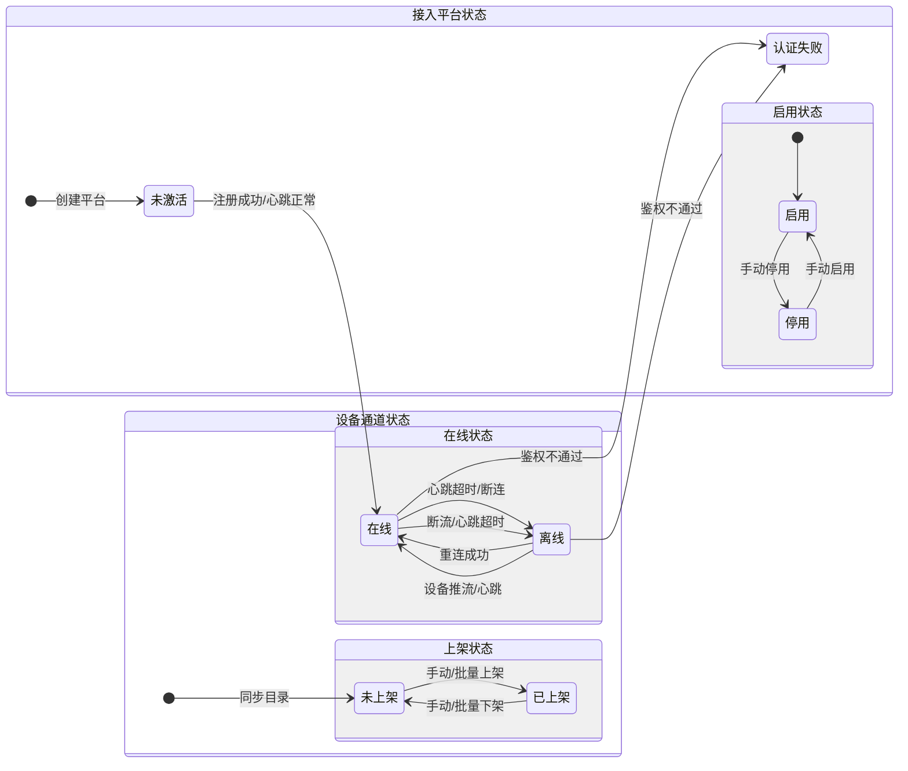

# 4. 物联网设备管理

## 4.1 概述

本模块对接下级接入平台，管理接入网关、通道资源及设备类别。实现对多源异构物联网设备（视频设备、IoT 传感器等）的统一接入与管理。

## 4.2 平台设备管理

### 4.2.0 平台/通道状态机

### 4.2.1 平台列表

**用户目标**: 查看和管理所有接入的下级平台或网关设备。

#### 1. 搜索项

*   **平台编码**：支持模糊搜索。
*   **平台名称**：支持模糊搜索。
*   **平台类型**：下拉选择（如：国标 GB28181、大华 ICC、海康等）。

#### 2. 列表字段

*   **平台名称**：文本显示。
*   **平台类型**：显示平台的协议或厂商类型。
*   **平台 IP**：IPv4 或 IPv6 地址。
*   **平台端口**：服务端口号。
*   **认证状态**：显示认证结果（在线、离线、认证失败、未激活）。
*   **接入状态**：开关状态（正常/异常或启用/停用）。
*   **操作**：
    *   **编辑**：点击打开编辑平台弹窗，回显当前平台信息。
    *   **删除**：点击删除当前平台，需二次确认。

#### 3. 操作说明

*   **新增平台**：点击打开新增平台弹窗。
*   **查询/重置**：对列表数据进行筛选或重置筛选条件。

### 4.2.2 原子操作：新增/编辑接入平台

**用户目标**: 注册新的 IoT/视频接入网关（上级视角看是“平台设备”）。

#### 1. 字段规范

| 字段 | 类型 | 必填 | 说明/约束 |
| :--- | :--- | :--- | :--- |
| **平台名称** | String | **是** | 自定义平台名称 |
| **平台类型** | Select | **是** | 枚举值：国标、大华 ICC、海康 ISC 等 |
| **平台 IP** | String | **是** | 需校验 IPv4/IPv6 格式 |
| **启用 https** | Select | **是** | 枚举值：开启、关闭 |
| **http 端口** | Integer | 否 | 整数 |
| **https 端口** | Integer | 否 | 整数 |
| **授权类型** | Select | 否 | 接入授权方式 |
| **网络类型** | Select | 否 | 枚举值：公网、专网 |
| **rtsp 规则** | String | 否 | 拉流地址转换规则 |
| **用户名称** | String | 否 | 接入账号 |
| **平台密码** | String | 否 | 掩码显示，支持查看明文 |
| **凭证 ID** | String | 否 | API 调用凭证 ID |
| **凭证密钥** | String | 否 | API 调用密钥，掩码显示 |
| **平台标识** | String | **是** | 唯一编码（如 20 位国标码） |
| **端口** | Integer | **是** | SIP 信令端口或服务端口 |
| **认证密码** | String | **是** | 接入认证口令 |
| **目录订阅** | Boolean | 否 | 开启后自动接收下级目录变更通知 |

#### 2. 交互说明

*   **确定**：校验必填项和格式，保存数据并返回列表。
*   **取消**：放弃编辑，关闭弹窗。

### 4.2.3 原子操作：删除接入平台

*   **触发**：点击列表中的“删除”按钮。
*   **校验**：
    *   校验该平台下是否已同步了设备通道。
    *   若有已同步的设备，提示“该平台下存在已关联的设备通道，请先下架或删除设备”，阻止删除。
*   **交互**：
    *   弹出二次确认框：“确定要删除平台【xxx】吗？删除后将无法恢复。”
    *   点击“确定”执行删除，并刷新列表。
    *   点击“取消”关闭确认框。

---

## 4.3 平台通道管理

### 4.3.1 通道列表

**用户目标**: 强制同步下级平台的最新设备列表，并管理通道状态（上架/下架）。

#### 1. 界面布局

*   **左侧导航**：平台通道树。
    *   支持按“平台类型”筛选。
    *   支持按“组织名称”搜索。
    *   展示平台及下属组织结构，显示（在线/总数）。
*   **右侧内容**：设备/组织管理区域。
    *   **Tab 切换**：设备、组织。

#### 2. 设备列表管理

**搜索项：**

*   **设备名称**：输入框，模糊搜索。
*   **通道编码**：输入框，精确搜索。
*   **上架状态**：下拉选择（已上架、未上架）。
*   **只展示本级**：复选框，勾选后仅展示当前组织下的直属设备。

**列表字段：**

*   **复选框**：支持批量选择。
*   **设备名称**：文本显示。
*   **上架状态**：标签显示（已上架/未上架）。
*   **在线状态**：标签显示（在线/离线）。
*   **归属组织**：显示设备所属的组织路径。
*   **操作**：
    *   **上架/下架**：单个切换设备的上架状态。
    *   **播放**：点击预览设备实时画面。

**批量操作：**

*   **批量上架**：选中多个设备后，批量设置为上架状态。
*   **批量下架**：选中多个设备后，批量设置为下架状态。
*   **批量删除**：从本平台移除选中设备的同步记录。

#### 3. 交互流程：通道同步

1.  进入“平台通道管理”。
2.  左侧选择特定平台通道或根节点。
3.  点击左侧树上方的“更新通道”按钮（刷新图标）。
4.  系统向下级平台发送 Catalog 查询指令（或触发 API 同步）。
5.  系统根据返回结果全量/增量更新本地设备目录。
6.  列表刷新展示最新的通道详情。

---

## 4.4 设备分组管理

### 4.4.1 分组列表

**用户目标**: 查看和维护设备分组信息。

#### 1. 搜索项
*   **分组ID**：精确搜索。
*   **分组名称**：模糊搜索。
*   **操作**：查询、重置。

#### 2. 列表字段
*   **分组ID**：唯一标识。
*   **分组名称**：文本显示。
*   **设备数量**：统计该分组下的设备总数。
*   **说明**：分组备注信息。
*   **操作**：
    *   **详情**：点击进入分组详情页。
    *   **编辑**：点击弹出编辑弹窗。
    *   **删除**：点击弹出删除确认框。

#### 3. 页面操作
*   **新增**：点击弹出“新增”弹窗。

---

### 4.4.2 原子操作：新增/编辑分组

**用户目标**: 创建或修改分组基本信息。

#### 1. 弹窗字段
*   **分组名称**：必填，文本输入。
*   **说明**：选填，多行文本输入。

#### 2. 交互流程
*   **确定**：校验必填项，保存数据并刷新列表。
*   **取消**：关闭弹窗。

---

### 4.4.3 分组详情（设备管理）

**用户目标**: 管理特定分组下的设备成员。

#### 1. 信息概览
*   显示分组ID、设备总数、在线设备数。

#### 2. 设备搜索
*   **设备名称**：模糊搜索。
*   **产品名称**：模糊搜索。
*   **操作**：查询、重置。

#### 3. 设备列表
*   **工具栏**：
    *   **批量删除**：将选中设备从当前分组移除。
    *   **加入设备**：点击弹出“加入设备”弹窗。
*   **列表字段**：
    *   **复选框**：多选。
    *   **ID**：设备ID。
    *   **设备名称**：文本。
    *   **产品名称**：文本。
    *   **状态**：在线/离线。
    *   **操作**：移除（从分组中删除设备）。

---

### 4.4.4 原子操作：加入设备

**用户目标**: 将现有设备添加到当前分组。

#### 1. 弹窗布局
*   **左侧选择区**：
    *   **筛选**：产品分类（下拉）、产品名称（下拉）、设备名称（搜索）。
    *   **设备树/列表**：按产品分类展示设备，支持多选勾选。
*   **右侧已选区**：
    *   显示已勾选的设备列表。
    *   支持“清空”操作。

#### 2. 交互逻辑
*   **确定**：将选中的设备关联到当前分组，关闭弹窗并刷新详情列表。
*   **取消**：关闭弹窗。

---

### 4.4.5 原子操作：删除分组

*   **触发**：点击列表中的“删除”按钮。
*   **校验**：
    *   若分组下存在关联设备，提示“请先移除组内设备”，阻止删除。
    *   若无关联，弹出二次确认框，确认后删除。
